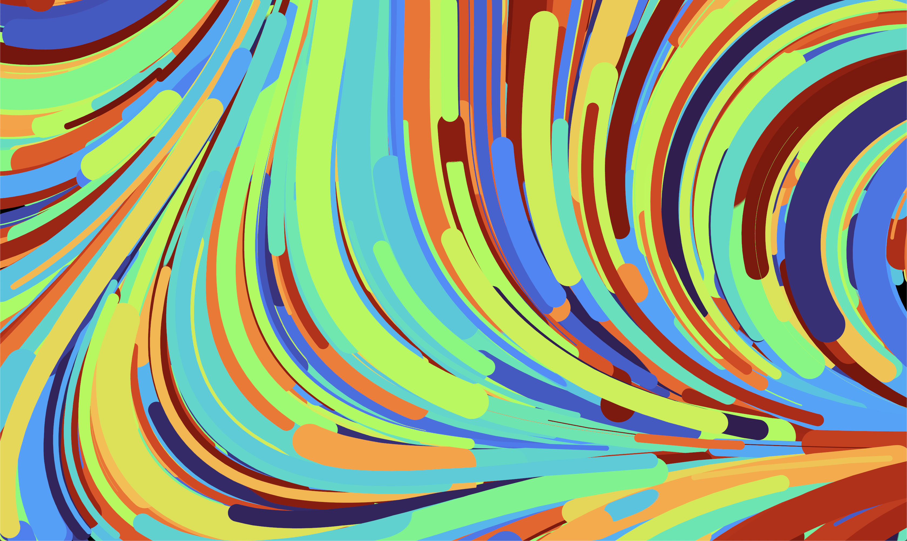
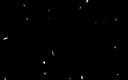

# Particle Flow Field



## Getting started

```shell
git clone git@github.com:Velfi/Flow.git
cd Flow

# To run the game
cargo run --release

# OR

# To install the game and the run it
cargo install
flow
```

## Controls

### Mouse Controls
Left Click  - Spawn a new particle where you clicked
Right Click - "Draw" new particles where you click and drag

### Keyboard Controls
Space       - Spawn new particle in a random location
Escape      - Exit the program
C           - Clear particle accumulation texture
/           - Show or hide the UI

### UI Controls
The UI provides access to all simulation parameters and actions:
- Quick Actions
  - Spawn Random Particle
  - Toggle Auto Spawn Particles
- Noise settings (scale, seed, function type)
- Particle settings (lifetime, thickness, speed)
- Background and line cap options
- Color LUT selection from a wide variety of professional color palettes
- Particle cleanup

Press `/` to show or hide the UI.

Note: Mouse input can be a bit buggy on MacOS, sorry about that.

I haven't figured out how to paint to different frames, so the ui will remain visible after hiding until it gets painted over or the background is switched.



